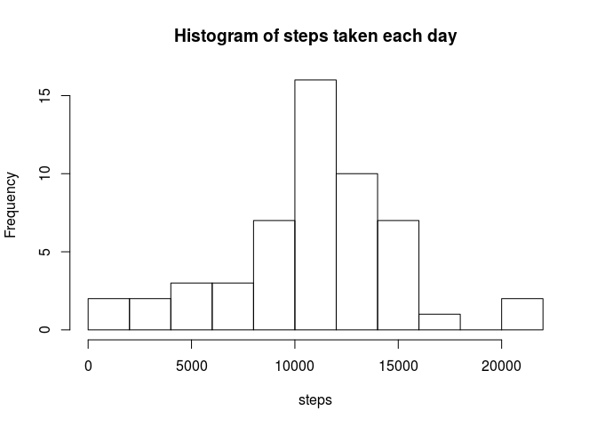

# Reproducible Research Course Project 1
Bhaskar Kamble  
May 21, 2016  


It is now possible to collect a large amount of data about personal movement using activity monitoring devices such as a Fitbit, Nike Fuelband, or Jawbone Up. These type of devices are part of the “quantified self” movement – a group of enthusiasts who take measurements about themselves regularly to improve their health, to find patterns in their behavior, or because they are tech geeks. But these data remain under-utilized both because the raw data are hard to obtain and there is a lack of statistical methods and software for processing and interpreting the data.

This assignment makes use of data from a personal activity monitoring device. This device collects data at 5 minute intervals through out the day. The data consists of two months of data from an anonymous individual collected during the months of October and November, 2012 and include the number of steps taken in 5 minute intervals each day.

The aim of the assignment is to analyse the data provided for each day for which the observations were taken, and to find the average daily pattern of the activity on the whole, as well as for weekdays and weekends.

# Reading the data

Let us first read the data from the csv file provided:


```r
data <- read.csv("activity.csv")
str(data)
```

```
## 'data.frame':	17568 obs. of  3 variables:
##  $ steps   : int  NA NA NA NA NA NA NA NA NA NA ...
##  $ date    : Factor w/ 61 levels "2012-10-01","2012-10-02",..: 1 1 1 1 1 1 1 1 1 1 ...
##  $ interval: int  0 5 10 15 20 25 30 35 40 45 ...
```
As the `date` variable indicates, the observations are recorded across 61 days. Each observation corresponds to the number of steps (the `steps` variable) taken for the interval indicated by the `interval` variable. One can check by the command `str(as.factor(data$interval))` that there are 288 obervations for each day, implying 17568 observations in total.


# Total number of steps taken per day

In this section we shall find the total number of steps taken for each day and store it in the array `dailysteps` in the following code chunk


```r
dailysteps <- NULL
for (i in 1:length(levels(data$date))) {
    dailysteps <- c(dailysteps,sum(data$steps[data$date==levels(data$date)[i]]))
}
dailysteps
```

```
##  [1]    NA   126 11352 12116 13294 15420 11015    NA 12811  9900 10304
## [12] 17382 12426 15098 10139 15084 13452 10056 11829 10395  8821 13460
## [23]  8918  8355  2492  6778 10119 11458  5018  9819 15414    NA 10600
## [34] 10571    NA 10439  8334 12883  3219    NA    NA 12608 10765  7336
## [45]    NA    41  5441 14339 15110  8841  4472 12787 20427 21194 14478
## [56] 11834 11162 13646 10183  7047    NA
```

We see that there are 8 days which contain at least one NA. Later we shall see that in fact all the observations for these days are NAs. 

## Histogram, mean, and median

For now we shall simply ignore the days with NAs and plot the histogram and calculate the mean and the median. In a later section we shall impute reasonable values to the missing data. Plotting the histogram, and finding the mean and the median is achieved by the following code chunk


```r
hist(dailysteps,breaks=10,xlab="steps",main="Histogram of steps taken each day")
```

<!-- -->

```r
mean(dailysteps,na.rm=TRUE)
```

```
## [1] 10766.19
```

```r
median(dailysteps,na.rm=TRUE)
```

```
## [1] 10765
```

The mean is therefore 10766.19 and the median is 10765.

# Average daily activity pattern

Here we shall make a time series plot of the 5-minute interval (x-axis) and the average number of steps taken, averaged across all days (y-axis).

Let us find the levels in the `intervals` variable:


```r
interval_ids <- levels(as.factor(data$interval))
str(interval_ids)
```

```
##  chr [1:288] "0" "5" "10" "15" "20" "25" "30" "35" ...
```

There are thus 288 intervals for each day. Next let us store the data according to the interval id, averaged over all the days for each interval id under the `id_steps_mean` object:


```r
xaxis <- sort(as.integer(levels(as.factor(data$interval))))
id_steps_mean <- NULL
for (i in 1:length(levels(as.factor(data$interval)))) {
    this_data <- data$steps[data$interval==levels(as.factor(data$interval))[i]]
    id_steps_mean <- c(id_steps_mean,mean(this_data, na.rm=TRUE  ))
}
```

## Time series plot of the average number of steps taken

Let us now make a time-series plot of `id_steps_mean`.


```r
plot(xaxis,id_steps_mean,type="l",ann=FALSE)
title(xlab="interval",ylab="steps",main="Time series plot of steps")
```

<!-- -->

## Interval with maximum number of steps


The interval with the maximum number of steos can be found as follows

```r
interval_ids[id_steps_mean==max(id_steps_mean)]
```

```
## [1] "835"
```

Thus the interval 835 has the maximum number of steps. The actual number of steps can be found as follows


```r
max(id_steps_mean)
```

```
## [1] 206.1698
```

Therefore the maximum number of steps averaged across all days for any interval is 206.1698113.

# Finding and imputing missing values

## Finding missing values

The total number of NA values is 2304, as can be easily found as follows


```r
sum(is.na(data))
```

```
## [1] 2304
```

Let us lok at the NA values in more detail. Let us look once again at the object `dailysteps`.


```r
dailysteps
```

```
##  [1]    NA   126 11352 12116 13294 15420 11015    NA 12811  9900 10304
## [12] 17382 12426 15098 10139 15084 13452 10056 11829 10395  8821 13460
## [23]  8918  8355  2492  6778 10119 11458  5018  9819 15414    NA 10600
## [34] 10571    NA 10439  8334 12883  3219    NA    NA 12608 10765  7336
## [45]    NA    41  5441 14339 15110  8841  4472 12787 20427 21194 14478
## [56] 11834 11162 13646 10183  7047    NA
```

It shows that out of the 61 days, there are 8 days which contain at least one NA. Which are these days? This can be found by the following code


```r
dates <- levels(data$date)
dates_with_NA <- dates[is.na(dailysteps)]
dates_with_NA
```

```
## [1] "2012-10-01" "2012-10-08" "2012-11-01" "2012-11-04" "2012-11-09"
## [6] "2012-11-10" "2012-11-14" "2012-11-30"
```

And exactly how many NAs there are in each of the above days can be found by the following code


```r
how_many_NA <- NULL
for (i in 1:length(dates_with_NA)) {
how_many_NA <- c(how_many_NA,sum(is.na(data$steps[data$date==dates_with_NA[i]])))
}
how_many_NA
```

```
## [1] 288 288 288 288 288 288 288 288
```

Hence all 288 observations in each of the 8 days are NA.

## Imputing missing values

We therefore have to impute all 288 values for each of the 8 days where the data is missing. we can impute to each NA observation simply the mean number of steps for an  interval averaged over all the days, but that would not reflect the change in the behavior across the entire day.

In a previous section we have found activity pattern for each interval id averaged over all the days. This data reflects how the behavior changes across the day and is therefore, at least in the subjective opinion of the author, a more realistic estimate of the missing data. Let us threfore use this data to impute the missing values. The following code chunk will achieve this objective.


```r
data_imputed <- data
for (i in 1:length(dates_with_NA)) {
data_imputed$steps[data_imputed$date==dates_with_NA[i]] <- as.integer(id_steps_mean)
}
```

In the above, we have created a new dataset `data_imputed` where the values are filled in.

## Histogram, mean, and median of data with imputed values

Let us now find the total number of steps taken for each day for the imputed data in the following code chunk which stores the data in `dailysteps_imp`


```r
dailysteps_imp <- NULL
for (i in 1:length(levels(data_imputed$date))) {
    dailysteps_imp <- c(dailysteps_imp,sum(data_imputed$steps[data_imputed$date==levels(data_imputed$date)[i]]))
}
dailysteps_imp
```

```
##  [1] 10641   126 11352 12116 13294 15420 11015 10641 12811  9900 10304
## [12] 17382 12426 15098 10139 15084 13452 10056 11829 10395  8821 13460
## [23]  8918  8355  2492  6778 10119 11458  5018  9819 15414 10641 10600
## [34] 10571 10641 10439  8334 12883  3219 10641 10641 12608 10765  7336
## [45] 10641    41  5441 14339 15110  8841  4472 12787 20427 21194 14478
## [56] 11834 11162 13646 10183  7047 10641
```

Next, let us find the histogram, mean and the median:


```r
hist(dailysteps_imp,breaks=10,xlab="steps",main="Histogram of steps taken each day with imputed data")
```

<!-- -->

```r
mean(dailysteps_imp)
```

```
## [1] 10749.77
```

```r
median(dailysteps_imp)
```

```
## [1] 10641
```

The 8 days with missing data now have 10641 as total number of steps. The height of the middle bar has consequently increased. There is a decrease in the mean since the total number of steps in the days with the missing data is 10641, which is less than the previous mean, thus bringing the mean down. The median is the new value of 10641.

## Panel plot for weekdays and weekends

First let us find the days of the week in the given data.


```r
week_day <- weekdays(as.Date(data_imputed$date))
daynames <- levels(as.factor(week_day))
daynames
```

```
## [1] "Dienstag"   "Donnerstag" "Freitag"    "Mittwoch"   "Montag"    
## [6] "Samstag"    "Sonntag"
```
  
(Please note that the `weekdays` command above gives the names of the weekdays in German since this analysis was carried out in Germany.) In English, the above names correspond to Tuesday, Thursday, Friday, Wednesday, Monday, Saturday, Sunday. Now we introduce the variable `daytype` which indicates if the day is a weekday or a weekend.


```r
data_imputed$daytype <- "weekday"
data_imputed$daytype[(week_day=="Samstag")|(week_day=="Sonntag")] <- "weekend"
data_imputed$daytype <- as.factor(data_imputed$daytype)
```

Now let us calculate the average daily activity corresponding to weekdays and weekends. The average daily activity for weekdays (the number of steps taken in each interval averaged over all non-weekend days) will be stored in `id_weekday` and the corresponding data for weekends will be stored in `id_weekend`.


```r
id_weekday <- NULL
id_weekend <- NULL
for (i in 1:length(levels(as.factor(data_imputed$interval)))) {
    logvar <- (data_imputed$interval==levels(as.factor(data_imputed$interval))[i])&(data_imputed$daytype=="weekday")
    this_data <- data_imputed$steps[logvar]
    id_weekday <- c(id_weekday,mean(this_data))
    logvar <- (data_imputed$interval==levels(as.factor(data_imputed$interval))[i])&(data_imputed$daytype=="weekend")
    this_data <- data_imputed$steps[logvar]
    id_weekend <- c(id_weekend,mean(this_data))
}
```

Let us now collect these data into a single data frame including the day type and the intervals. This will be useful for plotting purposes.


```r
end_data <- data.frame(steps=id_weekend,interval=xaxis,daytype="weekend")
day_data <- data.frame(steps=id_weekday,interval=xaxis,daytype="weekday")
data_by_daytype <- rbind(end_data,day_data)
```

And finally we can use the above data to make the required panel plots. We use the `ggplot2` package for this purpose.


```r
library(ggplot2)
g <- ggplot(data_by_daytype,aes(interval,steps)) + geom_line() + facet_wrap(~daytype,ncol=1,nrow=2)
print(g)
```

<!-- -->

It appears from the above plot that for weekdays the subject is active only in the earlier part of the day and shows lesser activity later on. From this we can infer that the subject probably works in an office during weekdays which does not involve much movement, while there is considerable activity in the morning which can be ascribed to his/her getting ready to go to work, or walking to the nearest bus / tram station to get to work, or maybe even a daily gym routine. On the other hand, the behavior during weekends is more evenly distributed throughout the day, which could probably be because of time spent on shopping or outings with the family.
